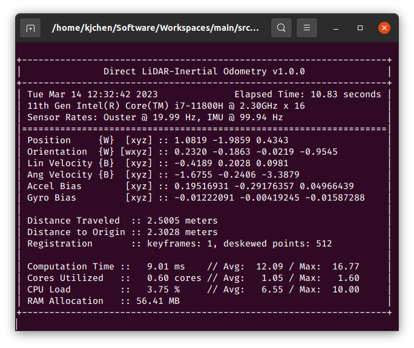

# 1. DLIO-PGO

### 1.1 Dependencies


The following has been verified to be compatible, although other configurations may work too:

- Ubuntu 20.04
- ROS Noetic (`roscpp`, `std_msgs`, `sensor_msgs`, `geometry_msgs`, `nav_msgs`, `pcl_ros`)
- C++ 14
- CMake >= `3.12.4`
- OpenMP >= `4.5`
- Point Cloud Library >= `1.10.0`
- Eigen >= `3.3.7`
- GTSAM >= 4.0.0

### 1.2 Compiling


Livox

```
git clone https://github.com/Livox-SDK/Livox-SDK.git
cd Livox-SDK
cd build && cmake ..
make
sudo make install
```

livox_ros_driver

```
cd ~/catkin_ws/src
git clone https://github.com/Livox-SDK/livox_ros_driver.git
cd ~/catkin_ws && catkin_make
```

Compile using the [`catkin_tools`](https://catkin-tools.readthedocs.io/en/latest/) package via:

```
mkdir ws && cd ws && mkdir src && catkin init && cd src
git clone https://github.com/lovelyyoshino/3DGS_LIVO_reconstruction.git
catkin_make
```


### 1.3 Execution


After compiling, source the workspace and execute via:

```
roslaunch direct_lidar_inertial_odometry dlio.launch \
  rviz:={true, false} \
  pointcloud_topic:=/robot/lidar \
  imu_topic:=/robot/imu
```


for Ouster, Velodyne, Hesai, or Livox (`xfer_format: 0`) sensors, or

```
roslaunch direct_lidar_inertial_odometry dlio.launch \
  rviz:={true, false} \
  livox_topic:=/livox/lidar \
  imu_topic:=/robot/imu
```


for Livox sensors (`xfer_format: 1`).

Be sure to change the topic names to your corresponding topics. Alternatively, edit the launch file directly if desired. If successful, you should see the following output in your terminal:

[]()

### 1.3Services


To save DLIO's generated map into `.pcd` format, call the following service:

```
rosservice call /robot/dlio_map/save_pcd LEAF_SIZE SAVE_PATH
```


### 1.4 Test Data

For your convenience, we provide test data [here](https://drive.proton.me/urls/Z83QCWKZWW#bMIqDh02AJZZ) (1.2GB, 1m 13s, Ouster OS1-32) of an aggressive motion to test our motion correction scheme, and [here](https://drive.proton.me/urls/7NQSK9DXJ0#gZ9yjGNrDBgG) (16.5GB, 4m 21s, Ouster OSDome) of a longer trajectory outside with lots of trees. Try these two datasets with both deskewing on and off!


# 2. Livox点云标定


# 3. Livox点云上色

