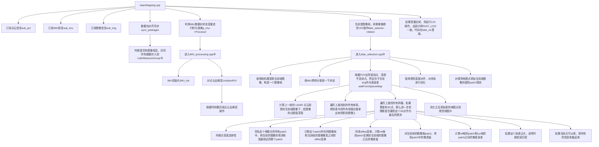

# 1. 3DGS_LIVO_reconstruction

### 1.1 Dependencies


The following has been verified to be compatible, although other configurations may work too:

- Ubuntu 20.04
- ROS Noetic (`roscpp`, `std_msgs`, `sensor_msgs`, `geometry_msgs`, `nav_msgs`, `pcl_ros`)
- C++ 14
- CMake >= `3.12.4`
- OpenMP >= `4.5`
- Point Cloud Library >= `1.10.0`
- Eigen >= `3.3.7`
- GTSAM >= `4.0.0`
- Sophus

### 1.2 Compiling


Livox

```
git clone https://github.com/Livox-SDK/Livox-SDK.git
cd Livox-SDK
cd build && cmake ..
make -j16
sudo make install
```


~~直接自带，无需再安装livox_ros_driver~~

```bash
mkdir -p ~/catkin_ws/src
cd ~/catkin_ws/src
git clone https://github.com/Livox-SDK/livox_ros_driver.git
cd ~/catkin_ws && catkin_make
```


Compile using the [`catkin_tools`](https://catkin-tools.readthedocs.io/en/latest/) package via:

```bash
cd ~/catkin_ws 
git clone https://github.com/lovelyyoshino/3DGS_LIVO_reconstruction.git src
catkin_make
```


### 1.3 Execution

After compiling, source the workspace and execute via:

```bash
roslaunch fast_livo mapping_avia.launch
rosbag play YOUR_DOWNLOADED.bag
```

Fast-LIVO流程图



